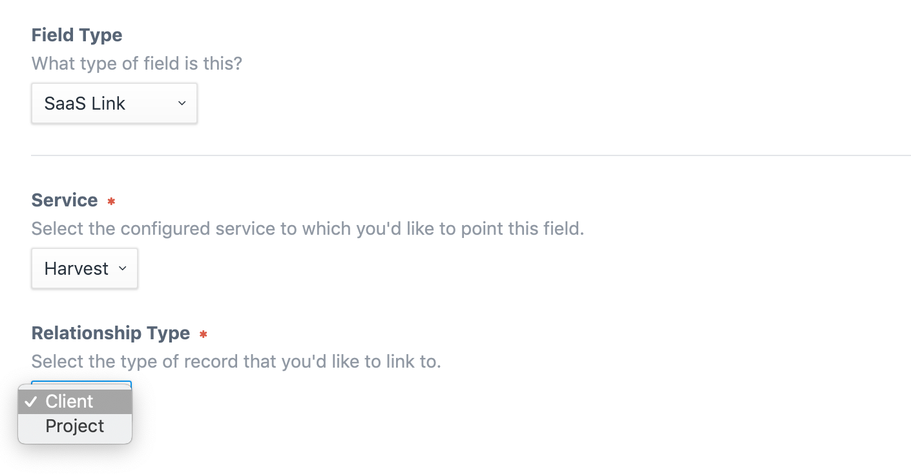
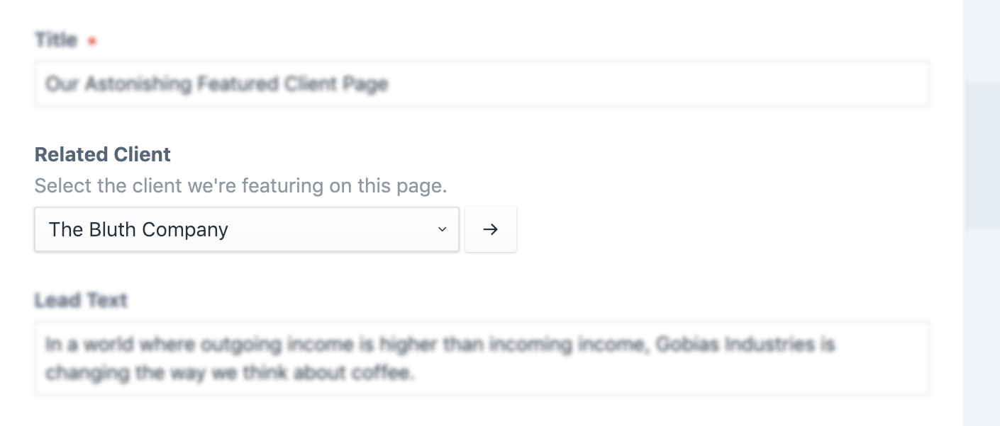

<h1 align="center">SaaS Link Craft CMS 3 Plugin</h1>

<h4 align="center">A Field Type for saving convenient links to stuff in <a href="https://capsulecrm.com/">Capsule</a>, <a href="https://www.getharvest.com/">Harvest</a>, and <a href="https://trello.com">Trello</a>.</h4>

## Field Settings

Relate to...

- Capsule People, Organizations, and Opportunities
- Harvest Clients and Projects
- Trello Boards

## Field Example

There are some Craft service and variable classes that do a bit more, but those aren't fleshed out and documented yet.

Why Capsule, Harvest and Trello? That's just what we've used. Submit an issue or PR if there's a service you'd love to see added.

## Installation

- `composer require workingconcept/saas-link`
- `./craft install saas-link` or install from _Settings_ → _Plugins_ in the control panel

## Support

[Submit an issue]() with a thoughtful description and we'll do our best to tackle it as soon as we can. Pull requests, feedback, and suggestions are all welcome!

---

## Improvement List

- [ ] store Harvest and Capsule base URLs in the database, and update them if settings change
- [ ] use typeahead field UI
- [ ] improve field UI to clarify behavior (service icon, etc.)
- [ ] make it easy for developers to add custom services
- [ ] add and document template variables
- [ ] make plugin settings more civilized and validate carefully

---

This plugin is brought to you by [Working Concept](https://workingconcept.com), which has no affiliation with Capsule, Harvest or Trello.
